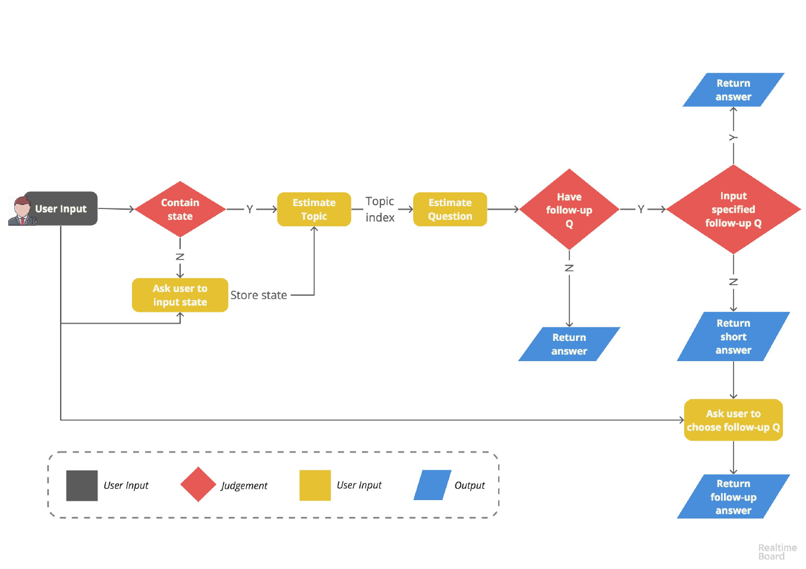
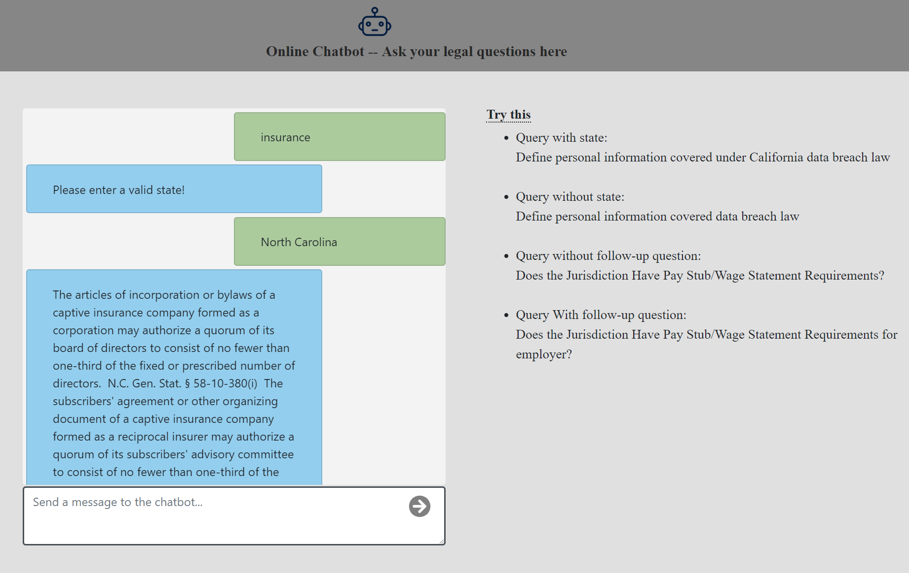
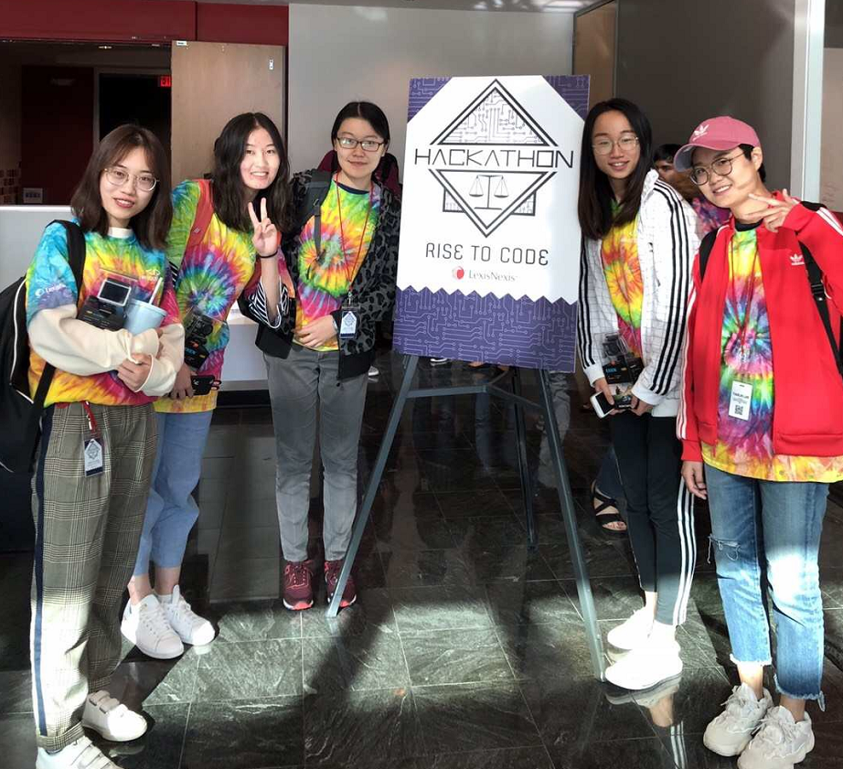

# mychatbot
## Hackathon project for annual LexisNexis Rise to Code Hackathon 2018 (Won the second price)

This project is the hackathon project I and my teammates participated in 2018 fall. It is a chatbot which could answer user's legal questions based on user's input questions.
We were given a "database"(12 excel files) which contains answers for legal questions of 12 topics. When user type in a query, we would first see if there's a specific state indicated in the query.
If not, we would let user to indicate a state first. Then we would estimate the topic of the query based on term frequency. After we get the fitted topic, we would calculate the similarity between the user query and the questions under that topic in the given database using cosine similarity. We then get a list of similarity scores and we would return the answer of the question with the highest similarity score. Some questions will also have follow up questions, we would let user to choose follow up questions they might be interested in. Otherwise user could type "0" to quit.

Below is our flow chart:

Due to the privacy issue, I did not put the data source in my git repo.

## Technical Stack:
Used python to build the backend program.

* Data loading: Used xlrd module to read data from xlsx files and store them into python dictionary.
* Estimate topic: term frequency after removing stop words.
* Estimate question: cosine_similarity function from sklearn.metrics.pairwise

* Web interface: Used Django to built up the web application based on out backend python program.

Here's the sreen shot of the interface:

## Online Demo:
You can play with the chat bot using: http://yiwen.pythonanywhere.com/

## Team Members
YIWEN JIANG, YAXUE GUO, YU YUAN, TIANLIN LAN, XIAOMENG WANG

  

## Reference:
Hackathon problem statement (Problem 5)
http://hackathon.lexisnexis.com/fall2018/problemstatement.html

Implementing a chat system linked to a chatbot with Django
https://github.com/Six-wars/django-chat

## Requirements:
Requirements saved in `requirement.txt`

> pip install -r requirement.txt
