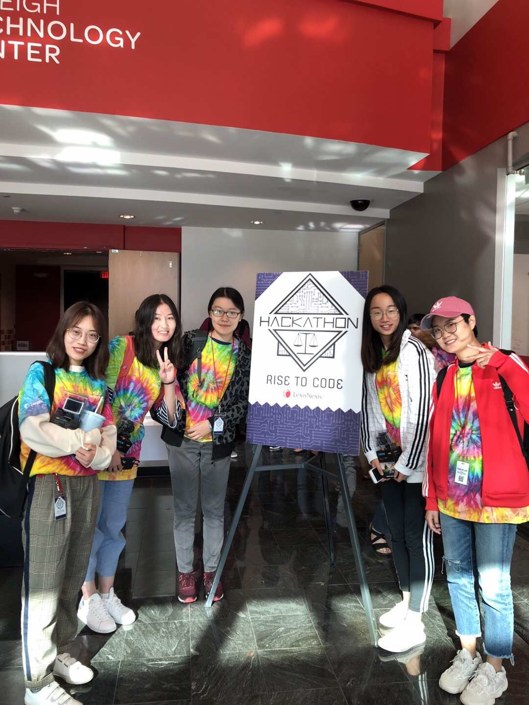

# mychatbot
Hackathon project for annual LexisNexis Rise to Code Hackathon 2018

This project is the hackathon project I and my teammates participated in 2018 fall. It is a chatbot which could answer user's legal questions based on user's input questions.
We were given a "database"(12 excel files) which contains answers for legal questions of 12 topics. When user type in a query, we would first see if there's a specific state indicated in the query.
If not, we would let user to indicate a state first. Then we would estimate the topic of the query based on term frequency. 

Below is our flow chart.

Due to the privacy issue, I did not put the data source in my git repo.

## Technical Stack:

Used Django to built up the web application based on out backend python program.

## Online Demo:
You can play with the chat bot using: http://yiwen.pythonanywhere.com/

## Team Members
YIWEN JIANG, YAXUE GUO, YU YUAN, TIANLIN LAN, XIAOMENG WANG

  

## Reference:
Hackathon problem statement (Problem 5)
http://hackathon.lexisnexis.com/fall2018/problemstatement.html

## Requirements:
Requirements saved in `requirement.txt`

> pip install -r requirement.txt
